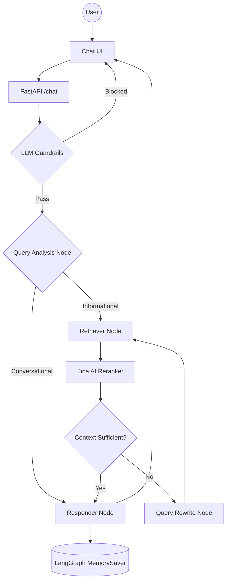

# 🎓 BRAC University AI Assistant

A production-grade, agentic RAG system built with **LangGraph**, **Portkey LLM Gateway**, and **Jina Embeddings**. The assistant answers questions about BRAC University using grounded, citation-backed retrieval from official university documents, with semantic reranking, custom LLM guardrails, and full conversation memory.

---

## 🎥 Project Demo

[▶️ Watch the Full Project Demo](https://www.youtube.com/watch?v=eJw-dA2ZP5Q)

---

## Key Features

- **Agentic Intelligence**: LangGraph for cyclic reasoning, multi-step planning, and conversation memory.
- **Custom Guardrails**: Lightning-fast, single-prompt LLM guardrails block off-topic, jailbreak, and injection inputs before any retrieval.
- **LLM Gateway**: Portkey routes all LLM calls with automatic fallback between primary and backup Groq keys.
- **Enterprise Search**: Qdrant Cloud for high-performance vector search + Jina AI Reranker API for semantic reranking.
- **Jina Embeddings**: High-performance `jina-embeddings-v5-text-small` embeddings via Jina AI.
- **Local Document Parsing**: PDF, HTML, TXT, DOCX, PPTX parsed entirely on-device — no external OCR service.
- **Observability**: Full trace nesting with **Pydantic Logfire** and **LangSmith** across every agent node.
- **Evaluation Suite**: DeepEval-powered evaluation across component, pipeline, and application levels.
- **Golden Dataset**: Dedicated retrieval, generation, and end-to-end evaluation datasets.
- **Production Ready**: Fully Dockerized architecture supporting sidecar deployment to AWS ECS Fargate and Heroku with Next.js.

---

## Agent Intelligence Flow



---

## Project Structure

```text
├── app/
│   ├── agents/
│   │   └── nodes/       # Planner, Retriever, Reranker, Responder LangGraph nodes
│   ├── gateway/         # Portkey LLM gateway — primary + fallback Groq routing
│   ├── guardrails/      # Custom single-prompt LLM guardrails
│   ├── ingestion/
│   │   ├── chunking/    # Structure-aware text splitter
│   │   └── loaders/     # Local parsers — PDF, HTML, TXT, DOCX, PPTX
│   ├── services/
│   │   └── retrieval/   # Jina embeddings + Qdrant search + Jina reranking
│   ├── config.py        # Centralized environment variable management
│   └── main.py          # FastAPI entrypoint — guardrails gate + /chat endpoint
├── frontend/            # Next.js Chat UI
├── evals/               # DeepEval evaluation suite (component/pipeline/application)
├── data/
│   ├── raw/scraped/     # Raw scraped BRAC University documents
│   ├── cleaned/         # Cleaned & normalized documents
│   └── golden/          # Retrieval, generation, and end-to-end golden datasets
└── requirements.txt     # Pinned dependencies
```

---

## Tech Stack

| Layer | Technology |
|-------|-----------|
| Orchestration | LangChain + LangGraph |
| LLMs | Groq (Llama 3.3 70B) via **Portkey** gateway |
| Guardrails | Custom LLM Guardrails (Latency < 250ms) |
| Vector DB | Qdrant Cloud |
| Reranking | Jina AI Reranker |
| Embeddings | Jina `jina-embeddings-v5-text-small` |
| Document Parsing | Local parsers (PDF, HTML, TXT, DOCX, PPTX) — no OCR service |
| Observability | Pydantic Logfire + LangSmith |
| Evaluation | DeepEval (component, pipeline, application level) |

---

## Getting Started

### 1. Install dependencies

```bash
uv venv 
source .venv/bin/activate
uv pip install -r requirements.txt
```

### 2. Configure environment

Create a `.env` file with the following keys:

```env
# Groq Reasoning Engine
GROQ_API_KEY=""
GROQ_FALLBACK_API_KEY=""          # second Groq key, or same as primary

# Portkey LLM Gateway
PORTKEY_API_KEY=""

# Qdrant Vector DB
QDRANT_API_KEY=""
QDRANT_CLUSTER_ENDPOINT=""        # e.g. https://your-cluster.cloud.qdrant.io:6333

# Jina AI (Reranker & Embeddings)
JINA_API_KEY=""

# Observability
LOGFIRE_TOKEN=""
LANGSMITH_TRACING=true
LANGSMITH_ENDPOINT=https://api.smith.langchain.com
LANGSMITH_API_KEY=""
LANGSMITH_PROJECT=""
```

### 3. Run data ingestion

The ingestion pipeline is separated into two steps:
1. **Chunking:** Parses documents from `data/cleaned/` into semantic chunks.
2. **Indexing:** Embeds the chunks using Jina AI and pushes them to Qdrant Cloud.

```bash
# Step 1: Chunk documents
python -m app.ingestion.processor data/cleaned

# Step 2: Index to Qdrant
python -m app.services.retrieval.indexer
```

### 4. Launch the app

```bash
uvicorn app.main:app --reload --port 8000
```

---

## Architecture & Features

This project implements an advanced Retrieval-Augmented Generation (RAG) pipeline designed for high accuracy, safety, and observability.

- 🧠 **LangGraph Agentic Routing:** Intelligently routes user queries, validates context, and actively rewrites failed queries for better retrieval.
- ⚡ **Jina AI Reranking:** Enhances vector search precision by reranking top candidates.
- 🛡️ **LLM Guardrails:** Real-time safety checks intercept off-topic questions, prompt injections, and jailbreak attempts using lightning-fast single-prompt LLM gateways.
- 🔄 **Portkey LLM Gateway:** Guarantees 99.9% uptime with automatic failover routing between primary and fallback inference models.
- 📊 **DeepEval Test Suite:** A robust evaluation suite that algorithmically scores Contextual Recall, Answer Relevancy, and Faithfulness. 
  - **Application-Level Metrics:** 100% Citation Pass Rate, 1.0 Avg Completeness, 0.86 Avg Correctness across the end-to-end RAG evaluation dataset.
- 🔍 **Full Observability:** End-to-end tracing enabled via Logfire and LangSmith for deep performance insights.

---

## Deployment

This application is fully Dockerized and supports the **Sidecar Pattern**, allowing you to run both the FastAPI backend and the Next.js frontend seamlessly side-by-side.

### Deploying to Heroku and Vercel
You can split the frontend and backend for easy deployment:
1. **Backend (Heroku):** Push to the `main` branch, and the configured GitHub Actions will automatically build the backend Docker container and deploy it to your Heroku application.
2. **Frontend (Vercel):** Connect your GitHub repository to [Vercel](https://vercel.com/). Vercel will automatically detect the Next.js project and deploy the frontend upon every commit. Add an environment variable `NEXT_PUBLIC_API_URL` pointing to your new Heroku URL.

### Deploying to AWS ECS Fargate
For enterprise scalability, the `docker-compose.yml` and `Dockerfile` are production-ready for Amazon ECS Fargate.
- **Backend Container:** Runs FastAPI on port 8000.
- **Frontend Container:** Runs Next.js on port 3000 (set `NEXT_PUBLIC_API_URL` to `http://localhost:8000`).

**AWS Configuration Tips:**
- **Architecture:** If you build your Docker image locally on an M1/M2/M3 Mac, be sure to set the ECS Task Definition Operating System/Architecture to **Linux/ARM64** (or build with `docker buildx build --platform linux/amd64`).
- **Commands:** In the Task Definition, override the frontend command to `npm,start`.
- **Security Group:** Ensure TCP ports `8000` and `3000` are open to the internet (`0.0.0.0/0`).

---

*Built with ❤️ for BRAC University Document Intelligence.*
